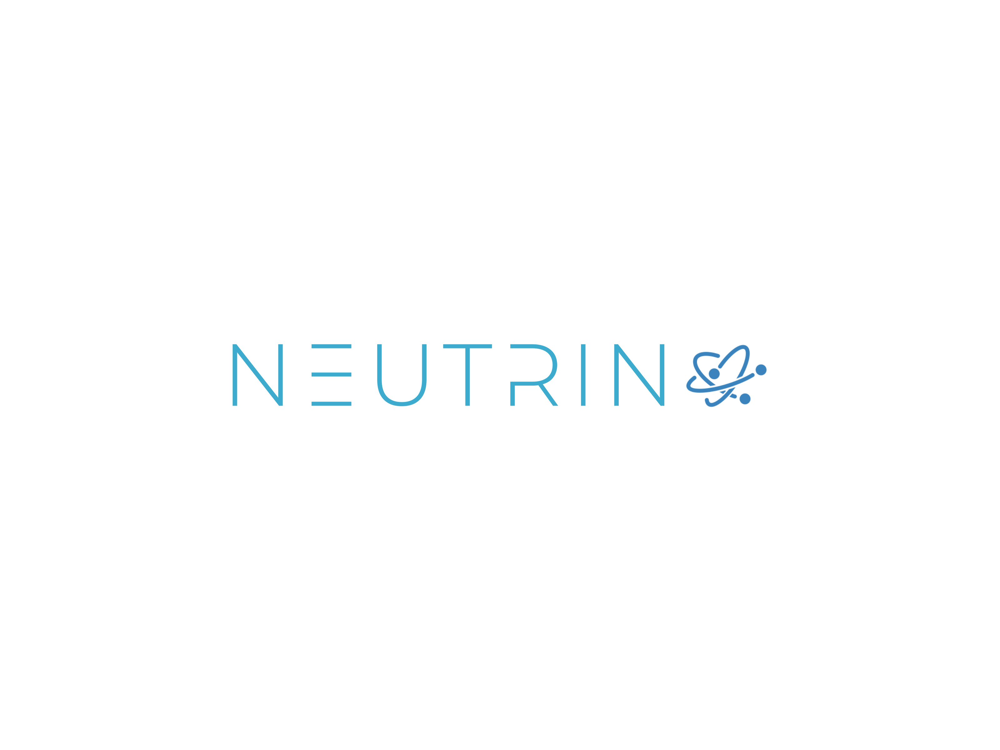

<div id="top"></div>

<br />
<div align="center">
  <a href="https://github.com/guanes/neutrino">
    
  </a>

  <h3 align="center">Neutrino: Fast development with Kubernetes and FastAPI</h3>

</div>

## About The Project

Neutrino is one template for projects created with FastApi, kubernetes manifest & skaffold.

### Skaffold

Skaffold is a command line tool that facilitates continuous development for container based & Kubernetes applications. Skaffold handles the workflow for building, pushing, and deploying your application, and provides building blocks for creating CI/CD pipelines.

If you need install skaffold, you can run this command:

```sh
curl -Lo skaffold https://storage.googleapis.com/skaffold/releases/latest/skaffold-linux-amd64 && \
sudo install skaffold /usr/local/bin/
```

you could need more information for the installaion, you can see the official documentation

[Skaffold documentation](https://skaffold.dev/docs/install/)

### Kind (Cluster local)

kind is a tool for running local Kubernetes clusters using Docker container “nodes”

#### Install
```sh
curl -Lo ./kind https://kind.sigs.k8s.io/dl/v0.17.0/kind-linux-amd64
chmod +x ./kind
sudo mv ./kind /usr/local/bin/kind
```
You can create the cluster, later install kind tool with the next command:
```sh
kind create cluster
```
And you want to create cluster with your own settings, lauch this command
```sh
kind create cluster --config kind/cluster.yaml
```
you see the configuration in the folder kind/cluster.yaml

### First run

If you already created the kubernetes cluster with kind, you could run the service with the next command:

```sh
 skaffold run 
```


also you can add a tag with the flag -t, like:

```sh
 skaffold run -t 1.0.0
```


* Note: the command skaffold run performs build and deploy of the service, if you only need deploy service, you could run skaffold deploy -t 1.0.0

### Additional things  

* **Note important**: when you use skaffold you already use kubernetes, then you will not have everthing you need in only file as in docker-compose. you will need to additionally create things like data bases, brokers for workers or whatever you need for run yours application.

You can install of simple shape, utilitys like a rabbitmq for workers, redis db for cache or keda for autoscale. Also can install differents data base like a postgresql or mongo, both with helm.

Just you need install helm. Helm helps you manage Kubernetes applications — Helm Charts help you define, install, and upgrade even the most complex Kubernetes application.

### Install helm
```sh
curl -fsSL -o get_helm.sh https://raw.githubusercontent.com/helm/helm/main/scripts/get-helm-3
chmod 700 get_helm.sh
./get_helm.sh
```

### Install rabbitmq
```sh
helm repo add bitnami https://charts.bitnami.com/bitnami
```
```sh
helm install rabbitmq bitnami/rabbitmq
```
you can create rabbitmq in other namespace, persistence for example
```sh
kubectl create namaspace persistence
```
```sh
helm install rabbitmq bitnami/rabbitmq -n persistence
```
### Install redis

[Redis documentation](https://redis.io/docs/)

```sh
helm repo add bitnami https://charts.bitnami.com/bitnami
```
```sh
helm install redis bitnami/redis
```
you can create redis in other namespace, persistence for example
```sh
kubectl create namaspace persistence
```
```sh
helm install redis bitnami/redis -n persistence
```

### Install keda

[Keda documentation](https://keda.sh/docs/2.9/)

```sh
helm repo add kedacore https://kedacore.github.io/charts
```
```sh
helm repo update
```

```sh
kubectl create namespace keda
helm install keda kedacore/keda --namespace keda
```
### Install postgresql
```sh
helm repo add bitnami https://charts.bitnami.com/bitnami
```
```sh
helm install postgresql bitnami/postgresql
```
when you run the command in the logs of console you could see the command for obtain the password, the command is like:

```sh
export POSTGRES_PASSWORD=$(kubectl get secret --namespace default postgresql -o jsonpath="{.data.postgres-password}" | base64 -d)
```


### Install mongo

```sh
helm repo add bitnami https://charts.bitnami.com/bitnami
```
```sh
helm install mongo bitnami/mongodb
```

when you run the command in the logs of console you could see the command for obtain the password, the command is like:
```sh
export MONGODB_ROOT_PASSWORD=$(kubectl get secret --namespace default mongo-mongodb -o jsonpath="{.data.mongodb-root-password}" | base64 -d)
```


